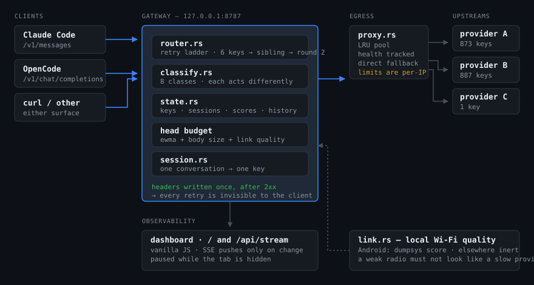
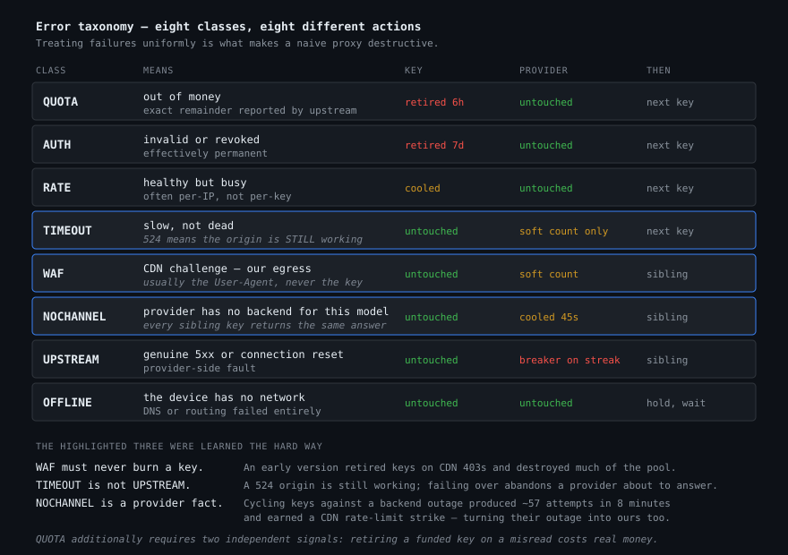
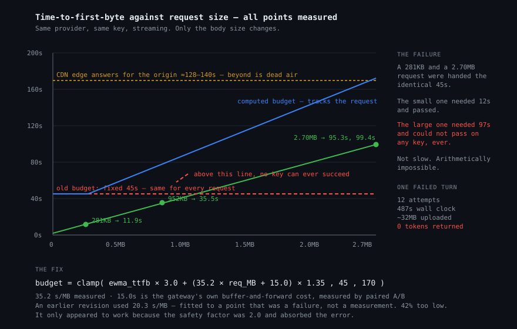

# Tabi Gateway

A local HTTP gateway that makes an unreliable pool of upstream API keys look like
one reliable endpoint.

It sits on `127.0.0.1:8787`, speaks both the Anthropic (`/v1/messages`) and
OpenAI (`/v1/chat/completions`) wire formats, and hides upstream failure from the
client: keys that run out of money, providers that lose their backends,
Cloudflare 502s, rate limits, mid-stream deaths, and a phone's Wi-Fi dropping.
The client sees a slow success instead of a fast error.

Written in Rust with `tokio` + `hyper` + `rustls`. No framework, no database,
eleven direct dependencies. Runs on an Android tablet under Termux inside a
~5%/hour battery budget, which is what forced most of the design decisions below.



---

## Why this exists

Cheap API resellers are individually unreliable. A key runs out of balance
mid-conversation. A provider's backend pool empties for ten minutes. Cloudflare
returns a 502 that has nothing to do with your request. Any single one of these
surfaces to a coding agent as a hard failure, and a coding agent's response to a
hard failure is to lose the conversation.

The gateway's contract is narrow and absolute:

> **Never emit a retryable error.** If a request can eventually succeed, keep
> working until it does or until the deadline. If it genuinely cannot succeed,
> return a readable terminal error before the client's own timeout fires.

Everything else follows from that.

---

## What it does

**Everything is editable from the dashboard.** Providers, routing weights, model
lists, model name mappings — all live in `providers.json`, hot-reloaded every
5 seconds without a restart. Add a provider, and its endpoint appears
automatically (`/providerid/v1/messages`); its models are probed and filled in.

**Auto-discovers what each provider serves.** A fast model sync probes
`/v1/models` for every provider every few seconds and unions the result into that
provider's model list. No hand-editing, no hardcoding — routing uses the union of
declared and probed models, so a provider the user KNOWS serves a model is never
penalised just because the probe came back empty.

**Model name mapping.** Clients ask for `claude-opus-5`; the upstream might call
it something else. Per-provider `model_map` rewrites the name before sending, so
one client name can land on any provider's channel.

**Retries across keys and providers.** A ladder: up to 6 keys on one provider,
then its sibling, then round two with backoff. All of it invisible — headers are
only written after a 2xx, so the client cannot tell whether it took one attempt
or twenty.

**Classifies failures into eight kinds, and treats each differently.** Lumping
them together is what makes naive proxies destructive:



`Quota` needs two independent signals before it will retire a key, because
retiring a funded key on a misread is expensive.

**Learns instead of assuming.** Per-request holds are read from real 403s rather
than hardcoded. Balances come from the provider's free `/v1/models` probe, so the
pool stays accurate without spending anything. Time-to-first-byte is tracked as a
per-provider EWMA and used to size timeouts.

**Sizes timeouts from the request.** A 281KB request and a 2.7MB request do not
need the same patience. Measured TTFB spans 11.9s to 99.4s across that range, so
any fixed timeout is wrong at one end:



Worked out against measurements in [Tuning](docs/TUNING.md), including the
earlier revision that got the slope 42% wrong and why it appeared to work anyway.

**Pins a session to a key.** One conversation keeps one key, which matters when
sibling keys share a wallet. Session identity survives client restarts and
context compaction via message-overlap matching.

**Rotates egress.** Upstream rate limits are per-IP as well as per-account, so
all requests tunnel through a pool of HTTP proxies with health tracking, LRU
selection, and a direct fallback when every proxy is cooling.

**Watches the local radio link.** On Android it samples `dumpsys wifi` and widens
timeouts when the device's own Wi-Fi is the bottleneck — otherwise a weak signal
is misattributed to the provider and healthy keys get marked slow. Inert
elsewhere.

**Reports.** A dashboard at `/` — no framework, vanilla JS and canvas — with
per-provider health, live sessions, key inventory, traffic, egress, and a
searchable error log. Server-sent events push on change only and pause when the
tab is hidden.

---

## Install

```sh
curl -fsSL https://raw.githubusercontent.com/Suydev/tabi-gateway/main/install.sh | sh
```

Or clone and run `./install.sh`. Windows: `install.ps1`. See
[docs/INSTALL.md](docs/INSTALL.md) for what the script does, and for the manual
path if you would rather not pipe a script into a shell.

You need Rust (the installer offers to fetch it) and one API key from a
`new-api`-compatible provider.

```sh
tabi start      # start in the background
tabi status     # health, per-provider summary, spend
tabi log        # follow the log
tabi restart    # after a rebuild
tabi stop
```

Point a client at it:

```sh
# Anthropic-shaped clients
export ANTHROPIC_BASE_URL=http://127.0.0.1:8787

# OpenAI-shaped clients
curl http://127.0.0.1:8787/v1/chat/completions \
  -H 'content-type: application/json' \
  -d '{"model":"claude-opus-5","messages":[{"role":"user","content":"hi"}]}'
```

Force a specific provider by prefixing the path: `/tabi/v1/messages`,
`/gorouter/v1/chat/completions`.

---

## Documentation

| | |
| --- | --- |
| [INSTALL.md](docs/INSTALL.md) | Platforms, prerequisites, what the installer does, manual setup |
| [CONFIGURATION.md](docs/CONFIGURATION.md) | Key files, proxies, providers, every environment variable |
| [ARCHITECTURE.md](docs/ARCHITECTURE.md) | Module map, request lifecycle, state model, design rationale |
| [TUNING.md](docs/TUNING.md) | The timeout arithmetic, with the measurements it came from |
| [API.md](docs/API.md) | Endpoints, both wire formats, error shapes, dashboard API |
| [TROUBLESHOOTING.md](docs/TROUBLESHOOTING.md) | Symptoms, causes, and how to read the error log |

---

## Design notes

A few decisions that are load-bearing and non-obvious.

**Headers are written exactly once, after a 2xx.** This is what makes retrying
invisible. It also means that once the gateway has committed to a response it can
no longer fail over — which is why mid-stream failure needs separate handling
rather than being treated as just another error.

**524 is not 502.** Cloudflare sends 524 when the origin is still working but
slow. Treating it as a death switches away from a provider that was about to
answer. It counts softly and does not trip the circuit breaker.

**A WAF block never burns a key.** The 403 is about our IP or User-Agent, and the
key is perfectly good. Early versions retired keys on these and destroyed a
sizeable pool before the cause was found.

**`no available channel` is a provider fact, not a key fact.** Every sibling key
returns the identical answer, so rotating them is pure waste. A real incident:
~57 attempts of 282-540KB across two providers in 8 minutes, which earned a
Cloudflare rate-limit strike and made a bad situation worse. Now the provider is
cooled and no key is touched.

**Timeouts are computed, not fixed.** Any constant is wrong at one end of the
range: measured TTFB spans 11.9s at 281KB to 99.4s at 2.70MB. The budget is
derived from measured throughput per megabyte plus the gateway's own overhead —
both measured, both documented in [TUNING.md](docs/TUNING.md).

**A degraded local link is not the provider's fault.** Without a signal for it,
every latency measurement silently blames the upstream for the device's antenna.

**Battery is a first-class constraint.** `opt-level = "z"`, `lto`,
`panic = "abort"`; SSE pushes only on change and pauses on a hidden tab; balance
sweeps are paced; state writes are coalesced. The target is ≤5%/hour on a tablet.

**Nothing binds to a public interface.** `BIND_ADDR` is `127.0.0.1`, not
configurable. The gateway holds every key in memory and has no authentication of
its own — exposing it would be handing out the pool.

---

## Development

```sh
cargo build --release     # ~4 min on a tablet, seconds on a laptop
cargo test --release      # 141 tests
cargo clippy --all-targets
```

**169 tests, no mocks and no network.** They are the specification for the parts
that are easy to get subtly wrong: the error taxonomy (28 tests), state and key
selection (49), routing (15), session identity (10), proxy pool (11), link
sampling (9), settings and provider management (new). Several encode incidents —
a `Retry-After` that was once parsed as 31 years, a fullwidth `＄` in a Chinese
balance message, an English quota refusal that fell through to the wrong class
and never rotated the key.

Do not restart the gateway from a session that is itself routed through it. That
severs your own connection. `tabi status` first; use a direct provider or accept
the disconnect.

---

## Repository layout

```
src/
  main.rs        server, routing table, signal handling, graceful shutdown
  router.rs      the retry ladder — the core of the thing
  upstream.rs    outbound requests, header hygiene, streaming head
  classify.rs    the error taxonomy
  state.rs       keys, sessions, providers, history; the one shared mutex
  session.rs     session identity, including survival across compaction
  config.rs      constants, every one with the reasoning attached
  settings.rs    runtime-editable providers and routing weights
  api.rs         dashboard JSON and SSE
  proxy.rs       egress pool: LRU, health, direct fallback
  helpers.rs     background tasks — probes, sweeps, flushing
  modelsync.rs   keeps a client's model list in step with the providers
  link.rs        local Wi-Fi quality (Android only, inert elsewhere)
web/             dashboard: no framework, no build step
docs/            the documents listed above
```

---

## License

MIT. See [LICENSE](LICENSE).
